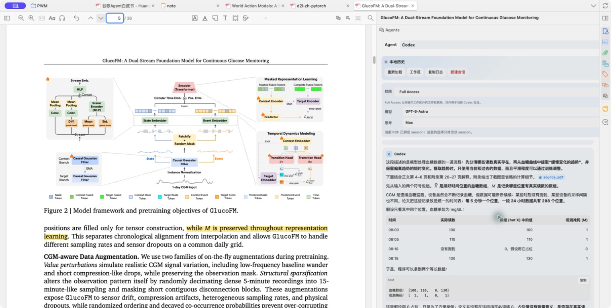
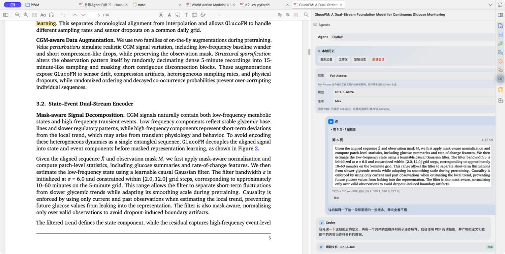
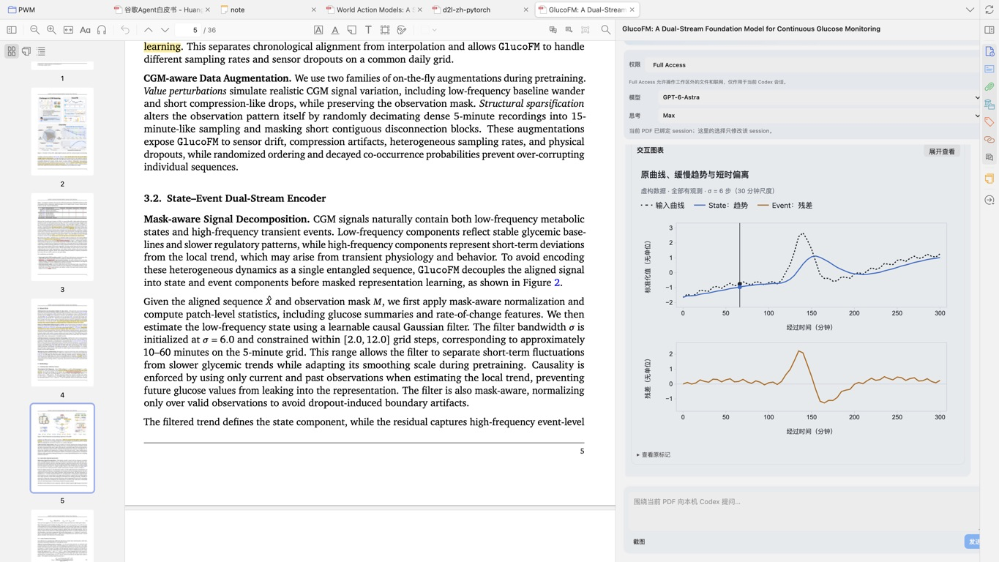
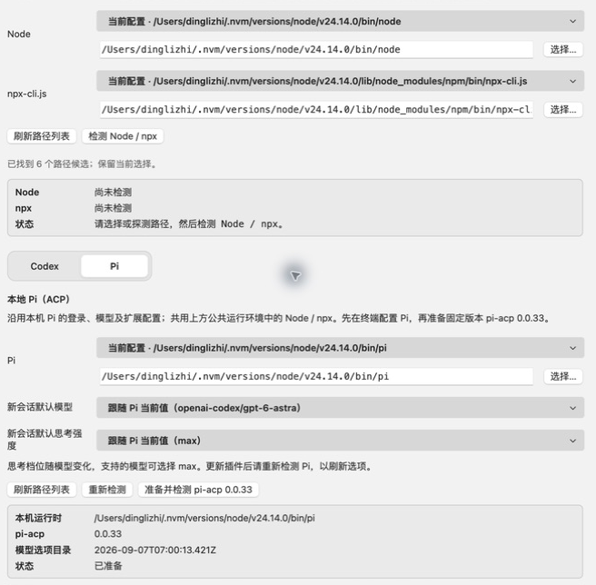

# Smart Paper Translator

[English](README.md) · 简体中文

**在 Zotero 里，一边读论文，一边和 Codex 或 Pi 讨论。**

Smart Paper Translator 把你电脑上已经配置好的 Codex 和 Pi 接入 Zotero 的 PDF 右侧栏。读到不理解的段落，可以直接选中提问；遇到复杂的图表，可以框选后一起发过去。下次打开这篇论文，还能接着上次的对话聊。

[下载安装包](https://github.com/dingdinglz/zotero-translate/releases) · [开始使用](#开始使用) · [反馈问题](https://github.com/dingdinglz/zotero-translate/issues)

<!-- screenshot: sidebar-overview -->


论文留在眼前，遇到不明白的地方，就在侧栏里接着问。

## 在侧栏里读论文

### 把正在读的内容带进对话

在 PDF 中选中文字，点击「添加到 Agents」，这段内容和对应的页码就会放进草稿。接着可以问：“这段论证依赖什么假设？”也可以先收集几处选区，再一起发送。

想问图表或公式时，点击阅读器工具栏或侧栏里的截图按钮，在 PDF 上框选即可。截图从 PDF 原页生成，不包含 Zotero 的界面和批注；跨页框选会按页拆成多张图片。

选区和截图都先留在草稿里，点击发送才会交给 Agent。图片提问需要支持图片输入的模型；如果当前模型不支持，草稿会保留，方便切换模型后再发。

<!-- screenshot: paper-context -->


发送过的截图和页码随问题保留，可以在历史消息中展开查看。

### 每篇论文，接着上次聊

每个 PDF 都有自己的对话。Codex 和 Pi 分别保存历史、草稿与模型设置，侧栏也会记住这篇论文上次用的是哪个 Agent。切换后看到的是所选 Agent 自己的历史。

模型和思考强度可以直接在侧栏调整。可选档位随模型变化，Pi 的部分模型支持 `max`。重启 Zotero 后仍能查看本地历史，再次发送时会恢复原来的 Agent 会话。

### 回答就在原文旁边

回答支持表格、代码、数学公式和 Mermaid 图表。文字可以直接选择和复制，回复生成过程中也能复制已经读到的内容。工具调用会显示为可展开的卡片。

如果 Agent 生成了本地 HTML 图表，并在回答中附上 `visualize` 标记，侧栏会在回复结束后显示预览。可以操作图表里的控件，也可以放大查看。图表在禁止联网的环境中运行，D3 已随插件内置。

<!-- screenshot: sidebar-results -->


对话生成的交互图表显示在原文旁边，方便对照理解。

## 开始使用

当前版本为 **0.1.37**，目标环境是 **macOS 上的 Zotero 9.0.6**，插件清单兼容范围为 Zotero 9.0.x。Agents 侧栏用于 Zotero 主窗口中的 PDF 标签页，暂不支持独立阅读器窗口。

### 安装插件

1. 在 [Releases](https://github.com/dingdinglz/zotero-translate/releases) 下载 `.xpi` 文件。
2. 打开 Zotero 的插件管理器，选择从文件安装插件，选中下载的 XPI。
3. 在 Zotero 主窗口打开 PDF，在右侧栏找到 **Agents**。

更新时需要下载新版 XPI 并手动安装。

### 连接 Agent

先在本机安装并配置好 Codex 或 Pi，确保登录和模型可用，同时准备 Node.js 和 npm。这些程序不包含在插件安装包中。Pi 需要 **0.85.1 或更新版本**，以及 **Node.js 22.19.0 或更新版本**。

1. 打开 Zotero 设置，进入 **Smart Paper Translator → Agents（ACP）**。
2. 在公共运行环境里选择 Node 和 `npx-cli.js` 的路径，点击「检测 Node / npx」。可以从检测到的本机路径中选择，也可以手动输入或浏览文件。
3. 在 Codex 或 Pi 标签页中选择对应的可执行文件，点击「准备并检测」。

| Agent | 插件准备的固定适配器 |
| --- | --- |
| Codex | `@agentclientprotocol/codex-acp@1.6.2` |
| Pi | `pi-acp@0.0.33` |

准备过程会下载固定版本的适配器，检测连接并读取模型选项，不发送提示词。完成后选好默认模型，就可以回到侧栏提问。日常启动使用已经缓存的适配器，不会在后台下载或升级依赖。

<!-- screenshot: agent-settings -->


Codex 和 Pi 共用 Node / npx 运行环境，各自配置模型与思考强度。

找不到路径或模型时，可以在设置里刷新路径列表或重新检测 Agent。使用 NVM 时，要检查 Zotero 中实际选择的 Node 路径，它可能和终端里用的不是同一个。更详细的配置与排查说明见[配置与实现参考](docs/technical-reference.zh-CN.md)。

## 翻译和术语本

阅读器也提供划线翻译，以及显示摘要和术语的悬浮面板。这部分单独配置翻译 API，内置 DeepSeek 预设，也支持兼容 OpenAI Chat Completions 的服务。

- 划选文字后翻译，已有译文会从缓存读取。自动划线翻译可在设置中开启，默认关闭。
- 在悬浮面板里查看摘要译文和保存的术语。配置好翻译服务后，打开 PDF 会自动翻译尚未缓存的摘要。
- 不需要的术语可以删除。也可以只对当前 PDF 关闭划线翻译，「添加到 Agents」仍然可用。
- 生成的英文智能标签显示在文库的独立列中，只存在插件本机缓存里，不修改 Zotero 原生标签。

使用 Agents 侧栏不需要配置翻译 API。

## 数据与 Agent 权限

打开 Agents 侧栏或切换 Agent 只读取本地历史，不请求模型生成。发送第一条消息时，插件会把 PDF 副本放到这篇论文的专用工作区，交给所选 Agent。后续发送问题和本轮附加的选区、截图；Agent 仍可读取工作区中的 PDF。

Agent 进程在本机运行，但它配置的模型服务可能收到论文内容和提示词。Codex 沿用本机账号与配置，包括 Skills 和 MCP；Pi 沿用自己的登录、模型及扩展。插件不会自动修改 Zotero 条目或导入生成文件。

Codex 新会话默认使用审批模式。可以为当前对话开启 **Full Access**，允许联网和操作工作区外的文件。Pi 按本机工具与扩展配置执行；专用工作区不构成 Full Access 或 Pi 的安全沙箱。

对话历史、PDF 副本和截图保存在 Zotero 数据目录下的 `smart-paper-translator/` 中，不加密，也不参与 Zotero 同步。文字和选区草稿只在本次 Zotero 运行期间保留，截图草稿可在重启后恢复。翻译 API Key 保存在 Mozilla Login Manager 中。

## 开发

修改插件代码前，请阅读 [AGENTS.md](AGENTS.md)。运行时文件位于 `plugin/`，测试和构建工具不打入 XPI。开发检查需要 Node.js 22、Python 3 和 Info-ZIP。

```bash
npm run check
sh scripts/build.sh
shasum -a 256 -c dist/SHA256SUMS
unzip -t dist/smart-paper-translator-0.1.37.xpi
```

构建产物输出到 `dist/`。涉及运行时代码的修改，还需要在目标 Zotero 版本中对 XPI 做非安装式解析。适配器行为、存储结构、渲染限制和历史验证结果见[配置与实现参考](docs/technical-reference.zh-CN.md)。

反馈问题时，请附上插件版本、Zotero 版本、所选 Agent 和复现步骤；日志与截图中请去掉 API Key 和私人论文内容。
